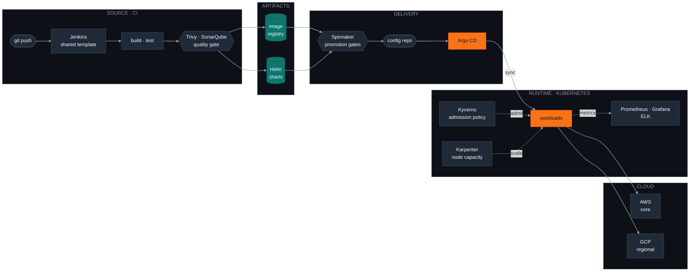

<div align="center">

# Muhammad Naimatullah Khan

**DevOps &amp; Platform Engineer at Veeam Software**

I keep Kubernetes platforms boring, so the teams on top of them can be interesting.

[](https://git.io/typing-svg)

<a href="https://www.linkedin.com/in/muhammad-naimatullah-khan"></a>
&nbsp;
<a href="mailto:muhammadnaimatullahkhan99@gmail.com"></a>
&nbsp;
<a href="https://naimss.vercel.app"></a>
&nbsp;
<a href="https://github.com/Cyber-Naimo"></a>


</div>

## `kubectl describe engineer naimatullah`

```yaml
apiVersion: platform.veeam.io/v1
kind: Engineer
metadata:
  name: muhammad-naimatullah-khan
  namespace: data-resilience
  labels:
    role: devops-platform
    focus: kubernetes
spec:
  replicas: 1
  owns:
    - jenkins-ci-templates
    - spinnaker-delivery
    - argocd-gitops
    - internal-tooling
  clouds: [aws, gcp]
  principles:
    - git is the only source of truth
    - alert before the customer notices
    - a backup is a rumour until you restore it
status:
  phase: Running
  uptime: 99.9%
  restartCount: 0
```

## Currently

Platform engineering for Veeam's data resilience products.

| | |
|:--|:--|
| **Runtime** | Kubernetes is the whole infrastructure, not a piece of it |
| **CI** | Jenkins, multiple shared pipeline templates so new services start with a working path |
| **CD** | Spinnaker promotion pipelines with real gates and real rollbacks |
| **Packaging** | Helm charts for everything that ships |
| **GitOps** | Argo CD keeping every cluster equal to git, drift visible on a dashboard |
| **Cloud** | AWS as core, GCP in select regions |
| **Scaling** | Karpenter provisioning against real demand instead of a fixed guess |
| **Policy** | Kyverno enforcing guardrails in the cluster, not in review comments |
| **Tooling** | Internal developer tools plus alerting and backup automation I build and maintain |

## Delivery pipeline I run



## Stack

<div align="center">


<br/>


<br/>


</div>

## Selected work

| Project | What it is | Outcome |
|:--|:--|:--|
| **[KubeForge](https://github.com/naimss-paysys/k8s-templates)** | Deployment CLI with preflight checks, diff preview, approval gate, auto rollback | 90% faster deploys, zero downtime |
| **DR pipeline** | Velero, OpenEBS and MinIO doing scheduled full cluster backups | Proven by deleting a cluster and restoring it |
| **ELK platform** | Filebeat to Logstash to Elasticsearch to Kibana across 9+ services | 60% faster detection |
| **[API platform](https://github.com/naimss-paysys/hoppscotch)** | Self hosted Hoppscotch with custom auth, RBAC, team workspaces | Postman licensing cost to zero |

## Open source

Code you can actually read.

| Repo | What it does |
|:--|:--|
| **[ai-devops](https://github.com/Cyber-Naimo/ai-devops)** | SRE command center for air gapped Linux fleets. FastAPI control plane, React dashboard, RPM packaged Python agent, SSH scanning, RBAC |
| **[ci-templates](https://github.com/Cyber-Naimo/ci-templates)** | Reusable GitLab CI templates for Java and Node microservices. One `include:` block and the pipeline is production ready |
| **[devsecops-assignment](https://github.com/Cyber-Naimo/devsecops-assignment)** | Two host Docker Swarm cluster, Consul over HTTPS, mTLS Docker, Terraform and Ansible, seven DevSecOps controls |
| **[FullStackChatApp-K8s](https://github.com/Cyber-Naimo/FullStackChatApp-K8s)** | Full stack chat app with a Jenkinsfile and Kubernetes manifests, built to be deployed rather than demoed |

## Experience

| Role | Company | Years |
|:--|:--|:--|
| DevOps Engineer | Veeam Software | 2026, present |
| Associate DevOps Engineer | Paysys Labs | 2025, 2026 |
| QA Engineer Intern | VentureDive | 2025 |
| Head of Offensive Security | ACM FAST NUCES | 2024 |

## Certifications


## Résumé

Full history, certifications and project detail in one PDF.

<a href="https://github.com/Cyber-Naimo/Cyber-Naimo/raw/main/Muhammad_Naimatullah_Khan.pdf"></a>
<a href="https://github.com/Cyber-Naimo/Cyber-Naimo/blob/main/Muhammad_Naimatullah_Khan.pdf"></a>
<a href="https://naimss.vercel.app"></a>

### Languages & Scripting


---

## 🚀 Featured Projects

### ⚙️ [KubeForge](https://github.com/naimss-paysys/k8s-templates) — Kubernetes Deployment CLI
> *One command to deploy any service to any country, safely and fast.*

- Bash CLI replacing hours of manual `kubectl` commands across 2 countries
- Pre-flight checks → diff preview → approval gate → **auto-rollback** on failure
- `70–90%` faster deployments · `0` downtime incidents

`Bash` `Kubernetes` `kubectl` `yq` `GitLab CI` `ELK Stack`

---

### 💾 [Enterprise DR Pipeline](https://github.com/Cyber-Naimo) — Disaster Recovery
> *Tested by actually deleting a cluster and restoring it — 100% recovery rate.*

- Velero + OpenEBS + MinIO full-cluster backup system
- Automated scheduled snapshots across all namespaces
- **100% data recovery** — not just backed up, proven to restore

`Velero` `OpenEBS` `MinIO` `Kubernetes` `Helm` `Bash`

---

### 📡 [ELK Stack Observability](https://github.com/Cyber-Naimo) — Log Intelligence Platform
> *One dashboard across 9+ microservices. Problems surface before users notice.*

- Filebeat → Logstash → Elasticsearch → Kibana full pipeline
- Custom alerting dashboards · `80%` faster detection · Real-time alerts

`Elasticsearch` `Logstash` `Kibana` `Filebeat` `Kubernetes`

---

### 🔧 [Internal API Platform](https://github.com/naimss-paysys/hoppscotch) — Self-Hosted Hoppscotch
> *Replaced paid Postman subscription with a self-hosted, fully owned alternative.*

- Custom auth, RBAC roles, private team workspaces
- `$0` licensing cost · Full internal data ownership

`Docker Compose` `Nginx` `PostgreSQL` `Redis` `OAuth` `RHEL 8.10`

---

## 🏅 Certifications & Awards

| Year | Award / Cert | Issuer |
|------|-------------|--------|
| 2025 | 🏆 **Raising the Bar Award** | Paysys Labs |
| 2025 | ⎈ **CKA — Certified Kubernetes Administrator** | KodeKloud |
| 2025 | 🥇 **Gold Medal — 1st Position** (Spring 2025) | FAST NUCES |
| 2024 | 🥇 **Gold Medal — 1st Position** (Fall 2024) | FAST NUCES |
| 2024 | ☁️ **Google Cloud Computing Foundations** | Google Cloud |
| 2024 | 🔒 **Google Cloud Cybersecurity Certificate** | Google Cloud |
| 2024 | 🔑 **Postman API Fundamentals Expert** | Postman |
| 2023 | 🛡️ **Ethical Hacking Essentials (EHE)** | EC-Council |

---

## 💼 Experience

**DevOps Engineer** · Veeam Software *(Aug 2026 – Present)*
> Building and operating infrastructure for data resilience and backup solutions, Kubernetes, CI/CD automation, and cloud platform reliability at enterprise scale.

**Associate DevOps Engineer** · Paysys Labs *(Aug 2025 – Aug 2026)*
> EKS Anywhere Kubernetes for RTGS fintech systems across Togo & Tanzania. Built KubeForge CLI, ELK Stack observability, DR pipeline, DevSecOps with Trivy + SonarQube. Trained 20+ engineers at partner banks.

**QA Engineer Intern** · VentureDive *(Mar 2025 – Jul 2025)*
> Automated Careem Dubai app with Maestro. Found 3+ critical security vulnerabilities. Built Selenium framework with Extent Reports and BDD/Cucumber.

**Head of Offensive Security** · ACM FAST NUCES *(2024)*
> Led offensive security wing, CTF events, penetration testing workshops, student security community.

---

## 📊 GitHub Stats

<div align="center">


</div>

<div align="center">

[](https://git.io/streak-stats)

</div>

---

## 🏆 GitHub Trophies

<div align="center">

[](https://github.com/ryo-ma/github-profile-trophy)

</div>

---

## 🐍 Contribution Snake

<div align="center">

<picture>
  <source media="(prefers-color-scheme: dark)" srcset="https://github-profile-summary-cards.vercel.app/api/cards/profile-details?username=Cyber-Naimo&theme=github_dark"/>
  
</picture>


<picture>
  <source media="(prefers-color-scheme: dark)" srcset="https://raw.githubusercontent.com/Cyber-Naimo/Cyber-Naimo/output/github-snake-dark.svg"/>
  
</picture>

</div>

## Get in touch

Open to conversations about platform engineering, GitOps, and running Kubernetes as the whole stack.

<a href="https://www.linkedin.com/in/muhammad-naimatullah-khan"></a>
<a href="mailto:muhammadnaimatullahkhan99@gmail.com"></a>


